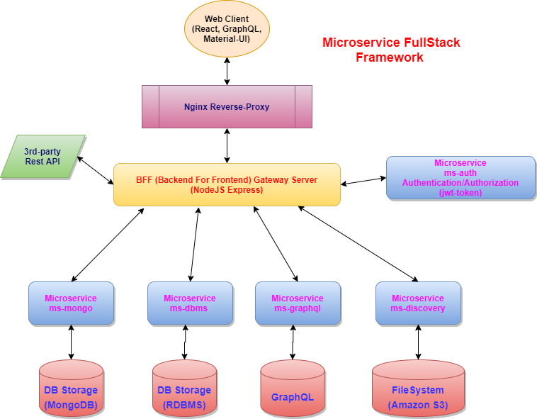
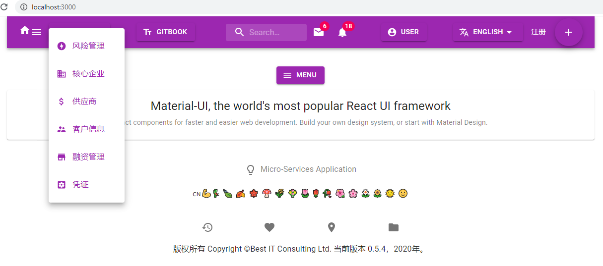
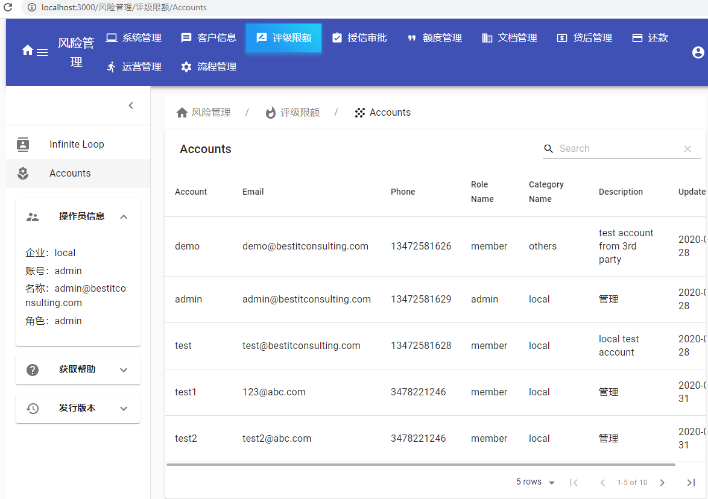
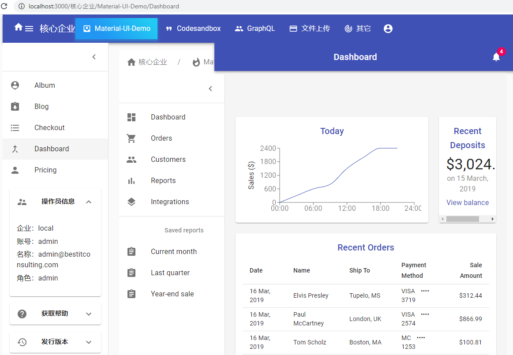
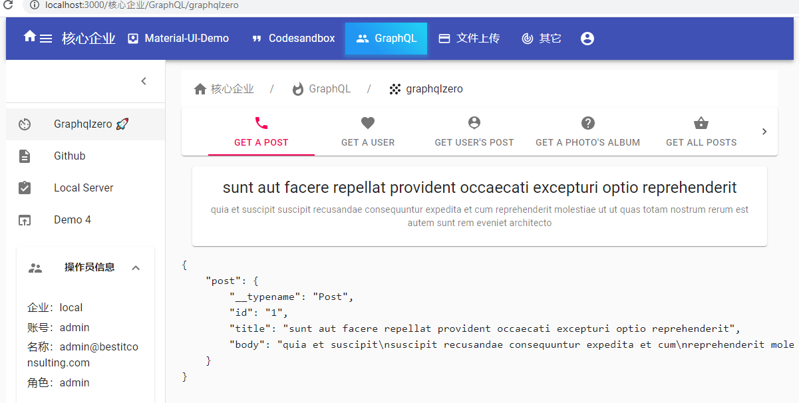
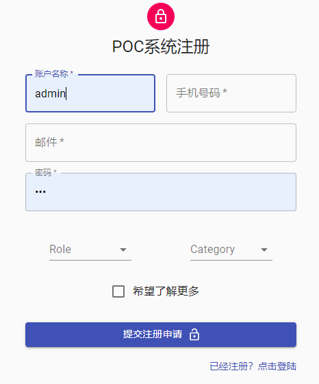

# Micro-service FullStack Framework



## client

---

- React, Material-UI, Hooks, Redux, React-Router-Dom
- Bootstrap from create-react-app

```shell
$ npx create-react-app client
```

## Backend

serveral backend micro-service apps, see [framework layout](etc/imgs/framework.png)

---

| microservice | function | note                              | memo                        |
| ------------ | -------- | --------------------------------- | --------------------------- |
| gateway      |          | BFF                               | proxy, cors                 |
| ms-auth      |          | JWT authentication, authorization | login, general verification |
| ms-dbms      |          | MySQL + Sequelize                 | multer                      |
| ms-mongo     |          | MongoDB + Mongoose                | multer                      |
| ms-discovery |          | zookeeper                         | service finder              |
| ms-graphql   |          | Apollo GraphQL                    | other repo                  |
| ms-gitbook   |          | gatsby + gitbook                  | other repo                  |

- Among all these microservices, there are 2 mandatory:

  ```text
    client: frontend
    gateway: BFF as gateway and static-resource service.
  ```

  Others are all optional.

- Use `express-generator` to generate backend microservice stub.
- For convenient, it is recommend to globally install common dependencies, such as `eslint`, `sequelize-cli`.

```shell
$ yarn add sequelize-cli
$ npx sequelize init
```

### Persistant Data

For data storage, there are 2 choices:

- install and setup `MySQL` / `MongoDB` as dependencies, check individual `bin/` scripts.
- use `docker` (I have an all-inclusive docker package)

Besides DBMS/NoSQL data storage which needs to separately install and setup, a quick implementation is to use `SQLite`. (check the example from another repo [ms-apollo-graphql](https://github.com/jxjwilliam/ms-apollo-graphql.git)).

### 包管理

---

- eslint
- prettier, airbnb
- husky
- lint-staged
- lerna
- concurrently
- cross-env
- pm2, nodemon

- `.huskyrc`在`git pre-commit`的钩子调起 `lint-staged`
- `lint-staged` 取得所有被提交的文件依次执行写好的任务(ESLint 和 Prettier), 如果有错误(没通过 ESlint 检查)则停止任务，等待下次`commit`，同时打印错误信息

### License

Use `MIT` license.

---

```shell
$ npx license (MIT)
```

### lerna

---

[](https://lerna.js.org/)

## Demo Pages

The following are some screenshots from the App:

### Menu1

---



### Menu2

---


### Admin1

---


### Admin2

---



### Admin3

---


### Admin4

---



### GraphQL

---



### Signup

---



### Login

---


### code examples

---

```text
    client/src:
      helpers/fetching.js
      components/logic.js
      components/layout.js
      07-sign/Signin.js
      09-service/index.js
    gateway/app.js
    ms-auth/services:
      utils.js
      auth.js
    ms-dbms:
      app.js
      services/crud.js
      routes/user.js
      controllers/user.js
      models/user.js
    ms-mongo/services/crud.js
```
