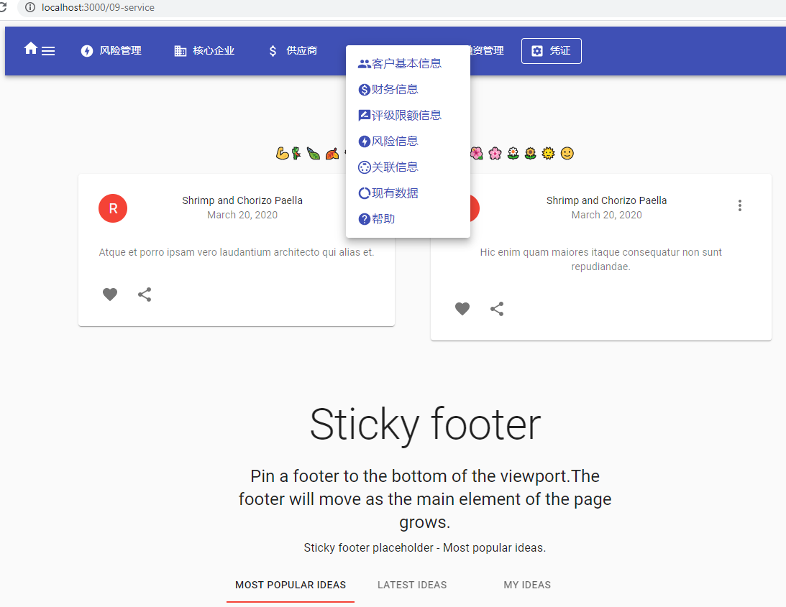
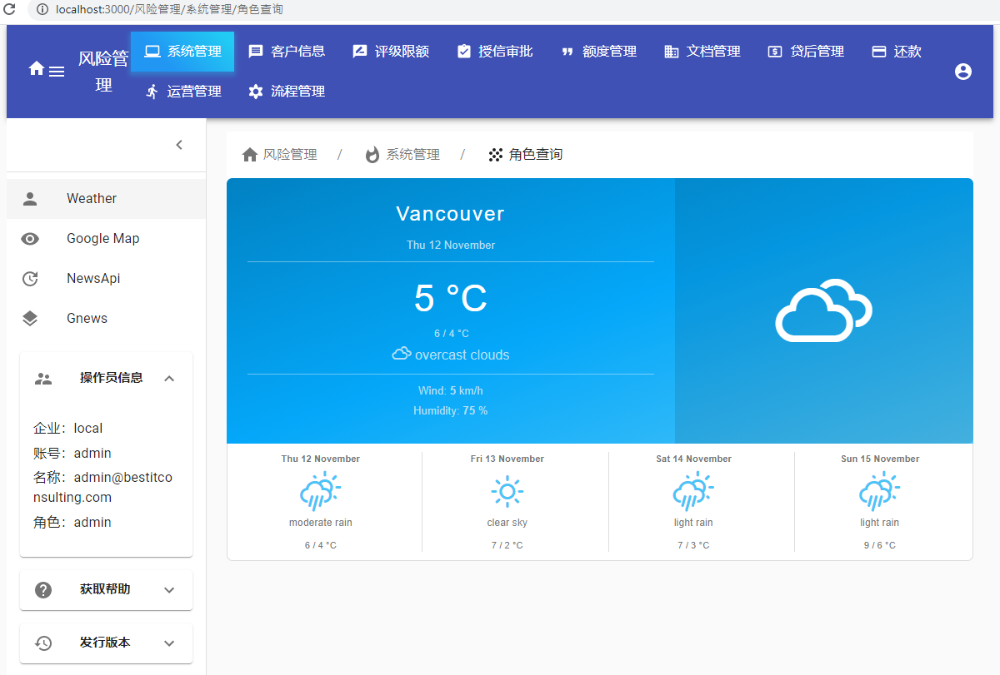
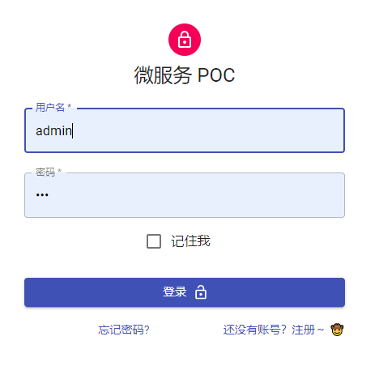

# Micro-service FullStack Framework


## client

---

- React, Material-UI, Hooks, Redux, React-Router-Dom
- Bootstrap from create-react-app

```shell
$ npx create-react-app client
```

## Backend

serveral backend micro-service apps, see [framework layout](etc/imgs/framework.png)

---

| microservice | function | note                              | memo           |
| ------------ | -------- | --------------------------------- | -------------- |
| gateway      |          | BFF                               | proxy, cors    |
| ms-auth      |          | JWT authentication, authorization |                |
| ms-dbms      |          | MySQL + Sequelize                 | multer         |
| ms-mongo     |          | MongoDB + Mongoose                | multer         |
| ms-discovery |          | zookeeper                         | service finder |
| ms-graphql   |          | Apollo GraphQL                    | other repo     |
| ms-gitbook   |          | gatsby + gitbook                  | other repo     |

```shell
$ npx express-generator ms-app
```

## ms-dbms

---

```shell
$ yarn add sequelize-cli
$ npx sequelize init
```

### 包管理

---

- eslint
- prettier, airbnb
- husky
- lint-staged
- lerna
- concurrently
- cross-env
- pm2, nodemon

- `.huskyrc`在`git pre-commit`的钩子调起 `lint-staged`
- `lint-staged` 取得所有被提交的文件依次执行写好的任务(ESLint 和 Prettier), 如果有错误(没通过 ESlint 检查)则停止任务，等待下次`commit`，同时打印错误信息

### License

---

```text
$ npx license (MIT)
```

### lerna

---

[](https://lerna.js.org/)

## Demo Pages:

The following are some screenshots from the App:

### Menu1

---


### Menu2

---



### Admin1

---



### Admin2

---


### Admin3

---


### Admin4

---


### GraphQL

---


### Signup

---


### Login

---


