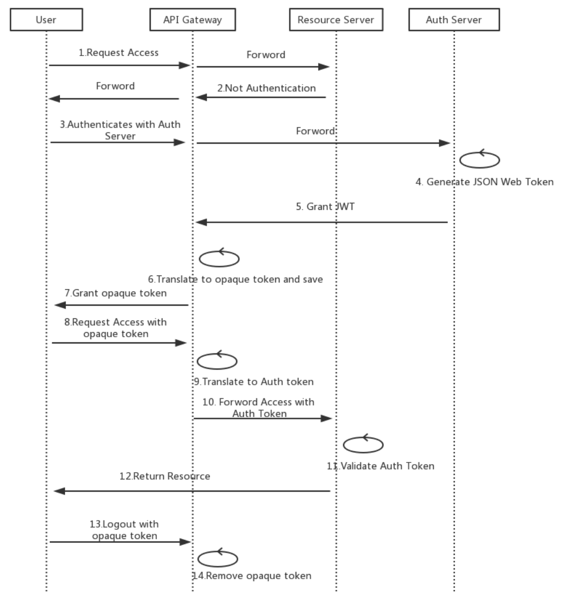

### 📑 Auth 微服务

---

这是一个 issue `jwt-token`的简单的微服务，使用`MongoDB` + `mongoose`

Auth Flow:

JWT Flow:

### 📑 功能

---

- 注冊，查詢，修改，刪除用戶信息表
- 登录，登出系统，issue 颁发 token 认证。

| action   | 调用            | 说明                                            |
| -------- | --------------- | ----------------------------------------------- |
| 注册     | signup/register | 保存用户信息，包括口令                          |
| 登录     | signin/login    | 验证用户信息, 调用 authentication/authorization |
| 退出     | signout/logout  | 取消 token                                      |
| 查看所有 | list            | 查看                                            |
| 查看一个 | get             | 查看 by id                                      |
| 编辑     | put             | 编辑 by id                                      |
| 删除     | remove          | 删除注册用户                                    |

> Notice: 多个表之间的关联

### 📑 Auth Service - Microservices Authentication and Authorization

---

If you have a single client application then you can do following steps, 当前就是这么做的：

- Make one microservice for authentication that generates `jwt token`.
  要有一个专门的 ms 来 issue token。

- The jwt contains all essential user information in its payload, ie Role, UserId etc.
  当前是包括的，login 成功之后就会生成，每次表单提交的时候传递。

- The `jwt token` will be sent in Authorization header for every authorised request.

- Before processing any request you can validate and decode the `jwt token` using middlewares. Now you can set the user's info in req object easliy and can easily access users role and its id in your controller.

- if the token is not valid then you can throw error in middlewares and it will provide json response of unauthorised.

- You can call the authentication api to validate and decode your token or you can write 3 to 4 line of code in every microservice in middleware.

### 📑 解决有效期的问题

---

JWT `Auth token`s + Session `Refresh token`s is usually the goto in microservice authentication. A central auth service handles the authentication and hands out 2 tokens: Auth and Refresh.

The `Auth token` is a very short lived JWT that can be used for stateless authentication across any service. It is not stored on servers at all.

The `Refresh token` is a very long lived session token that is used by the auth service to regenerate `Auth token`s as they expire. The `Refresh token` would be stored server site and be revokable at any time. If it has not been revoked or expired, then new `Auth token`s are handed out as needed.

So, a request to a microservices would pass just the `Auth token`. if it's valid, everything proceeds. If it has expired, then a client request is made to the auth service, passing the `Refresh token` along. If the `Refresh token` is valid, a new `Auth token` is returned, then the original microservice request is re-tried.

### 📑 TODO

---

- 用`mongo`，`mysql`还是`redis`缓存 authentication 的信息？

- 如何解决登录有效时间是 10 分钟的问题？

- `oAuth2` 允许微信，google 等账号登入。

### 参考

[bradtraversy/node_jwt_example](https://github.com/bradtraversy/node_jwt_example/blob/master/app.js)
