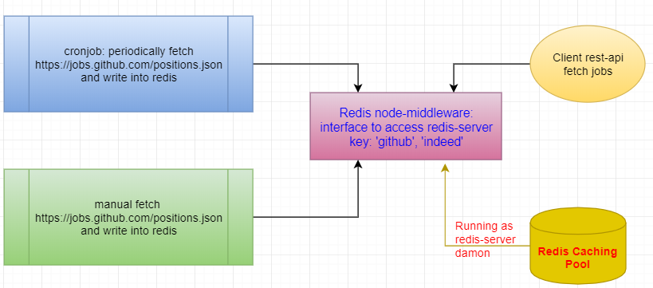

## 🪕 1. Redis

---



### 📑 resources

- [redis]()
- [npm redis](https://www.npmjs.com/package/redis)
- [Redis Client](https://redis.io/clients#nodejs)

### 📑 redis-server

```shell
  redis-server
```

### 📑 redis-client

```shell
  flushall
  flushdb
```

### 📑 npm redis for node

### 📑 access redis

## 🪕 2. Cron

---

## 🪕 3.

- `github` typeDef:
  ```javascript
  {
    id, type, url, created_at, company, company_url, location, title, description, how_to_apply, company_logo
  }
  ```
